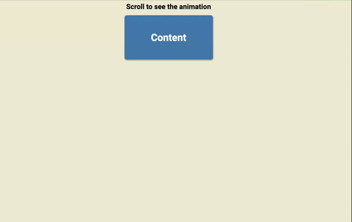

# Scroll Navigation

A simple project that displays cards one by one as the user scrolls down and disappears them one by one as they scroll up.

## Technologies Used

- HTML
- CSS
- JavaScript

## How to Use

1. Clone this repository to your local machine.
2. Open the `index.html` file in your web browser.
3. Scroll down to see the cards appear one by one.
4. Scroll up to see the cards disappear one by one.

## How It Works

The project uses JavaScript to listen for the `scroll` event on the window object. When the user scrolls down, the project checks if the next card should be displayed, and if so, it adds a class to the card that shows it on the screen. When the user scrolls up, the project checks if the previous card should be hidden, and if so, it removes the class that shows it on the screen.

The project also uses CSS to style the cards and the animation that shows and hides them.

